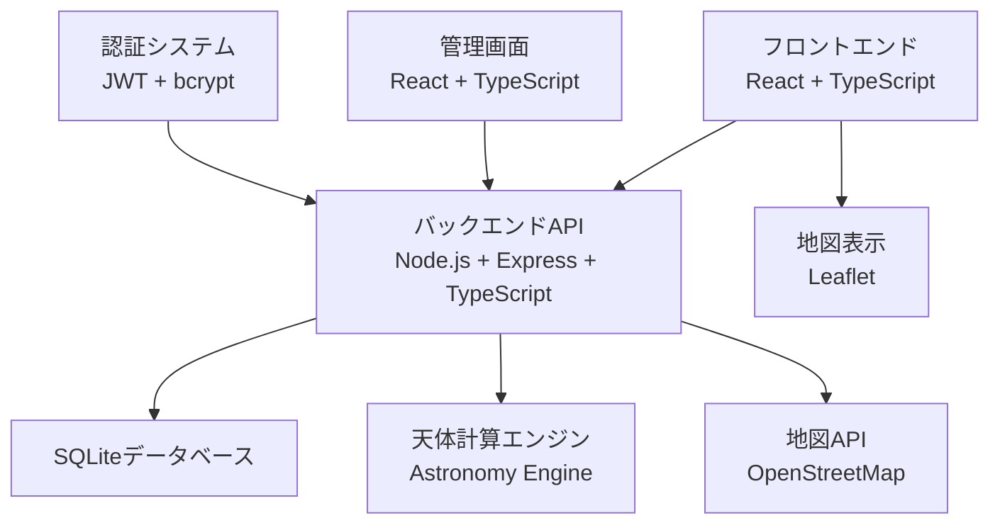

# 設計書

## 概要

ダイヤモンド富士とパール富士のカレンダーアプリケーションは、天体計算に基づいて撮影最適日時を提供するWebアプリケーションです。フロントエンド・バックエンド共にTypeScriptで実装し、SQLiteデータベースを使用してデータを永続化します。

## アーキテクチャ

### システム構成



### 技術スタック

- **フロントエンド**: React, TypeScript, CSS Modules
- **バックエンド**: Node.js, Express, TypeScript
- **データベース**: SQLite3
- **認証**: JWT (JSON Web Token), bcrypt
- **天体計算**: Astronomy Engine（NASA JPL準拠）
- **地図**: Leaflet
- **キャプチャ**: reCAPTCHA または独自実装
- **パフォーマンス**: 1分刻み検索 + 2段階最適化 + キューシステム + Redis キャッシュ

## コンポーネントとインターフェース

### フロントエンドコンポーネント

#### 1. カレンダーコンポーネント
```typescript
interface CalendarProps {
  year: number;
  month: number;
  events: CalendarEvent[];
  onDateClick: (date: Date) => void;
  onMonthChange: (year: number, month: number) => void;
}

interface CalendarEvent {
  date: Date;
  type: 'diamond' | 'pearl' | 'both';
  events: FujiEvent[];
}
```

#### 2. 日付詳細コンポーネント
```typescript
interface DateDetailProps {
  date: Date;
  events: FujiEvent[];
  onMapClick: (event: FujiEvent) => void;
}

interface FujiEvent {
  id: string;
  type: 'diamond' | 'pearl';
  subType: 'rising' | 'setting';
  time: Date;
  location: Location;
  azimuth: number;
  elevation?: number;
}
```

#### 3. 地図コンポーネント
```typescript
interface MapProps {
  center: [number, number];
  locations: Location[];
  fujiPosition: [number, number];
  showDirection: boolean;
  onLocationClick?: (location: Location) => void;
}
```

### バックエンドAPI

#### 1. カレンダーAPI
```typescript
// GET /api/calendar/:year/:month
interface CalendarResponse {
  year: number;
  month: number;
  events: CalendarEvent[];
}

// GET /api/events/:date
interface EventsResponse {
  date: string;
  events: FujiEvent[];
  weather?: WeatherInfo;
}
```

#### 2. 撮影地点API
```typescript
// GET /api/locations
interface LocationsResponse {
  locations: Location[];
}

// POST /api/admin/locations (認証必要)
interface CreateLocationRequest {
  name: string;
  prefecture: string;
  latitude: number;
  longitude: number;
  elevation: number;
  description?: string;
  accessInfo?: string;
  warnings?: string;
}
```

#### 3. リクエストAPI
```typescript
// POST /api/location-requests
interface LocationRequestBody {
  name: string;
  prefecture: string;
  description: string;
  suggestedCoordinates?: {
    latitude: number;
    longitude: number;
  };
  captchaToken: string;
}
```

## データモデル

### データベーススキーマ

```sql
-- 撮影地点テーブル（全ての時刻はJSTで保存）
CREATE TABLE locations (
  id INTEGER PRIMARY KEY AUTOINCREMENT,
  name TEXT NOT NULL,
  prefecture TEXT NOT NULL,
  latitude REAL NOT NULL,
  longitude REAL NOT NULL,
  elevation REAL NOT NULL,
  description TEXT,
  access_info TEXT,
  warnings TEXT,
  created_at DATETIME DEFAULT (datetime('now', '+9 hours')), -- JST
  updated_at DATETIME DEFAULT (datetime('now', '+9 hours'))  -- JST
);

-- 管理者テーブル（全ての時刻はJSTで保存）
CREATE TABLE admins (
  id INTEGER PRIMARY KEY AUTOINCREMENT,
  username TEXT UNIQUE NOT NULL,
  password_hash TEXT NOT NULL,
  created_at DATETIME DEFAULT (datetime('now', '+9 hours')), -- JST
  last_login DATETIME, -- JST
  failed_login_count INTEGER DEFAULT 0,
  locked_until DATETIME -- JST
);

-- 撮影地点リクエストテーブル（全ての時刻はJSTで保存）
CREATE TABLE location_requests (
  id INTEGER PRIMARY KEY AUTOINCREMENT,
  name TEXT NOT NULL,
  prefecture TEXT NOT NULL,
  description TEXT NOT NULL,
  suggested_latitude REAL,
  suggested_longitude REAL,
  requester_ip TEXT NOT NULL,
  status TEXT DEFAULT 'pending', -- pending, approved, rejected
  created_at DATETIME DEFAULT (datetime('now', '+9 hours')), -- JST
  processed_at DATETIME, -- JST
  processed_by INTEGER REFERENCES admins(id)
);

-- リクエスト制限テーブル（全ての時刻はJSTで保存）
CREATE TABLE request_limits (
  ip_address TEXT PRIMARY KEY,
  last_request_at DATETIME NOT NULL, -- JST
  request_count INTEGER DEFAULT 1
);
```

### TypeScript型定義

```typescript
interface Location {
  id: number;
  name: string;
  prefecture: string;
  latitude: number;
  longitude: number;
  elevation: number;
  description?: string;
  accessInfo?: string;
  warnings?: string;
  createdAt: Date;
  updatedAt: Date;
}

interface Admin {
  id: number;
  username: string;
  passwordHash: string;
  createdAt: Date;
  lastLogin?: Date;
  failedLoginCount: number;
  lockedUntil?: Date;
}

interface LocationRequest {
  id: number;
  name: string;
  prefecture: string;
  description: string;
  suggestedLatitude?: number;
  suggestedLongitude?: number;
  requesterIp: string;
  status: 'pending' | 'approved' | 'rejected';
  createdAt: Date;
  processedAt?: Date;
  processedBy?: number;
}
```

## 天体計算エンジン

### 計算ロジック

```typescript
interface AstronomicalCalculator {
  calculateDiamondFuji(date: Date, location: Location): FujiEvent[];
  calculatePearlFuji(date: Date, location: Location): FujiEvent[];
  getSunPosition(date: Date, latitude: number, longitude: number): SunPosition;
  getMoonPosition(date: Date, latitude: number, longitude: number): MoonPosition;
  calculateAzimuthToFuji(fromLocation: Location): number;
  isVisible(fromLocation: Location, targetAzimuth: number): boolean;
}

interface SunPosition {
  azimuth: number;
  elevation: number;
  sunrise: Date;
  sunset: Date;
}

interface MoonPosition {
  azimuth: number;
  elevation: number;
  moonrise: Date;
  moonset: Date;
  phase: number; // 0-1 (0: 新月, 0.5: 満月)
}
```

### 高精度天体計算エンジン（Astronomy Engine採用）

#### 技術選択の理由

**Astronomy Engine採用の利点**
- **高精度**: NASA JPL準拠の天体暦による正確な計算（実測誤差1-2分以内）
- **包括性**: 大気屈折、視差、地球の歳差運動を考慮
- **信頼性**: 天文学的に検証済みのアルゴリズム
- **長期精度**: 数十年先まで正確な予測が可能
- **実用性**: 撮影計画に十分な精度を実現

**パフォーマンス最適化戦略**
- **1分刻み検索**: 10秒→1分で83%の計算量削減
- **季節フィルタリング**: ダイヤモンド富士シーズン外はスキップ
- **2段階検索**: 粗い検索→精密検索で効率化
- **事前計算**: キューシステムによるバッチ処理

```typescript
// 最適化されたAstronomy Engine計算エンジン
export class OptimizedAstronomicalCalculator {
  private readonly SEARCH_INTERVAL_MINUTES = 1; // 1分刻み
  private readonly TOLERANCE = {
    azimuth: 1.0,    // ±1.0度（高精度維持）
    elevation: 0.5   // ±0.5度
  };
  
  // 高精度ダイヤモンド富士計算
  async calculatePreciseDiamondFuji(date: Date, location: Location): Promise<FujiEvent[]> {
    // ダイヤモンド富士シーズン判定
    if (!this.isDiamondFujiSeason(date)) {
      return []; // 季節外は即座に空配列を返す
    }
    
    const events: FujiEvent[] = [];
    const fujiAzimuth = this.calculateBearingToFuji(location);
    const fujiElevation = this.calculateElevationToFuji(location);
    
    // 最適化された検索範囲
    const searchRanges = this.getOptimizedSearchRanges(date);
    
    for (const range of searchRanges) {
      const optimalTime = await this.findOptimalTimeWithAstronomyEngine(
        date, location, fujiAzimuth, fujiElevation, range
      );
      
      if (optimalTime) {
        events.push(this.createFujiEvent(optimalTime, location, range.type));
      }
    }
    
    return events;
  }
  
  // 2段階最適化検索
  private async findOptimalTimeWithAstronomyEngine(
    date: Date, 
    location: Location, 
    targetAzimuth: number, 
    targetElevation: number,
    range: SearchRange
  ): Promise<Date | null> {
    // Phase 1: 10分刻みで候補範囲を特定（粗い検索）
    const roughCandidates = await this.findRoughCandidates(
      date, location, targetAzimuth, range, 10 // 10分刻み
    );
    
    if (roughCandidates.length === 0) return null;
    
    // Phase 2: 最有力候補の前後30分を1分刻みで精密検索
    const bestCandidate = roughCandidates[0];
    return await this.findPreciseTime(
      bestCandidate, location, targetAzimuth, targetElevation, 1 // 1分刻み
    );
  }
  
  // 季節による検索範囲最適化
  private getOptimizedSearchRanges(date: Date): SearchRange[] {
    const month = date.getMonth() + 1;
    const ranges: SearchRange[] = [];
    
    // 季節に応じた時間範囲の動的調整
    if (month >= 10 || month <= 2) { // 冬季
      ranges.push(
        { type: 'sunrise', start: 6, end: 9 },   // 冬の日の出：6-9時
        { type: 'sunset', start: 15, end: 18 }   // 冬の日の入り：15-18時
      );
    } else if (month >= 3 && month <= 5) { // 春季
      ranges.push(
        { type: 'sunrise', start: 5, end: 8 },   // 春の日の出：5-8時
        { type: 'sunset', start: 17, end: 19 }   // 春の日の入り：17-19時
      );
    }
    
    return ranges;
  }
  
  // Astronomy Engineを使用した高精度位置計算
  private async calculateSunPositionPrecise(time: Date, location: Location): Promise<CelestialPosition> {
    const observer = new Astronomy.Observer(location.latitude, location.longitude, location.elevation);
    const equatorial = Astronomy.Equator(Astronomy.Body.Sun, time, observer, true, true);
    const horizontal = Astronomy.Horizon(time, observer, equatorial.ra, equatorial.dec, 'normal');
    
    return {
      azimuth: horizontal.azimuth,
      elevation: horizontal.altitude,
      // 大気屈折補正済み
      correctedElevation: horizontal.altitude + this.getAtmosphericRefraction(horizontal.altitude)
    };
  }
  
  // 大気屈折補正
  private getAtmosphericRefraction(elevation: number): number {
    // 標準的な大気屈折補正式
    if (elevation > 15) {
      return 0.00452 * Math.tan((90 - elevation) * Math.PI / 180);
    } else {
      return 0.1594 + 0.0196 * elevation + 0.00002 * elevation * elevation;
    }
  }
}

interface SearchRange {
  type: 'sunrise' | 'sunset';
  start: number; // 時
  end: number;   // 時
}

interface CelestialPosition {
  azimuth: number;
  elevation: number;
  correctedElevation: number;
}
```

#### BullMQキューシステム（実装済み）

**アーキテクチャ概要**
```typescript
// キューベースの非同期計算システム
interface QueueSystem {
  // 4種類のキュー
  locationQueue: Queue<LocationCalculationJob>;    // 地点全体計算（2-3年分）
  monthlyQueue: Queue<MonthlyCalculationJob>;      // 月別計算
  dailyQueue: Queue<DailyCalculationJob>;          // 日別計算
  historicalQueue: Queue<HistoricalCalculationJob>; // 過去データ計算
}

// ジョブ定義
interface LocationCalculationJob {
  locationId: number;
  startYear: number;
  endYear: number;
  priority: 'high' | 'medium' | 'low';
  requestId?: string;
}

interface MonthlyCalculationJob {
  locationId: number;
  year: number;
  month: number;
  priority: 'high' | 'medium' | 'low';
}
```

**キューサービス実装**
```typescript
export class QueueService {
  // 地点登録時の自動計算スケジュール
  async scheduleLocationCalculation(
    locationId: number,
    startYear: number,
    endYear: number = startYear + 2,
    priority: 'high' | 'medium' | 'low' = 'medium'
  ): Promise<string>;
  
  // 月別計算スケジュール
  async scheduleMonthlyCalculation(
    locationId: number,
    year: number,
    month: number,
    priority: 'high' | 'medium' | 'low' = 'medium'
  ): Promise<string>;
  
  // 進捗監視
  async getQueueStats(): Promise<QueueStats>;
  async getJobProgress(jobId: string, queueType: string): Promise<JobProgress>;
}
```

**バッチ計算サービス**
```typescript
export class BatchCalculationService {
  // 地点全体の長期計算（キューワーカーから呼び出し）
  async calculateLocationEvents(
    locationId: number,
    startYear: number,
    endYear: number,
    progressCallback?: (progress: number) => void
  ): Promise<void>;
  
  // 月間計算（最適化済み）
  async calculateMonthlyEvents(
    locationId: number,
    year: number,
    month: number
  ): Promise<FujiEvent[]>;
  
  // キャッシュ統計
  async getCacheStatistics(): Promise<CacheStats>;
}
```

**事前計算済みデータテーブル**
```sql
-- events_cache テーブル（実装済み）
CREATE TABLE events_cache (
  id INTEGER PRIMARY KEY AUTOINCREMENT,
  cache_key TEXT UNIQUE NOT NULL,
  cache_data TEXT NOT NULL, -- JSON形式のイベントデータ
  created_at DATETIME DEFAULT (datetime('now', '+9 hours')),
  expires_at DATETIME,
  metadata TEXT -- 計算メタデータ（精度、バージョン等）
);

-- 高速検索用インデックス
CREATE INDEX idx_events_cache_key ON events_cache(cache_key);
CREATE INDEX idx_events_cache_expires ON events_cache(expires_at);
```

**運用フロー**
1. **地点登録時**: 自動的に3年分の計算をキューに追加
2. **定期バッチ**: 毎日午前2時に翌月分を自動計算
3. **緊急計算**: ユーザー要求時の高優先度計算
4. **フォールバック**: キュー失敗時はリアルタイム計算

#### 高性能キャッシュシステム（実装済み）

**Redis + メモリフォールバック方式**
```typescript
export class CacheService {
  // Redis接続（プライマリ）+ メモリキャッシュ（フォールバック）
  private redis: Redis | null = null;
  private fallbackCache = new Map<string, CacheEntry<any>>();
  
  // TTL設定（用途別最適化）
  private config: CacheConfig = {
    ttl: {
      monthlyCalendar: 24 * 60 * 60,      // 24時間
      dailyEvents: 12 * 60 * 60,          // 12時間
      locationEvents: 7 * 24 * 60 * 60,   // 7日間
      stats: 6 * 60 * 60,                 // 6時間
      upcomingEvents: 60 * 60,            // 1時間
      suggestions: 30 * 60                // 30分
    }
  };
}
```

**専用キャッシュメソッド**
```typescript
interface CacheService {
  // 月間カレンダー（最重要）
  getMonthlyCalendar(year: number, month: number): Promise<CalendarResponse | null>;
  setMonthlyCalendar(year: number, month: number, data: CalendarResponse): Promise<void>;
  
  // 日別イベント
  getDayEvents(dateString: string): Promise<EventsResponse | null>;
  setDayEvents(dateString: string, data: EventsResponse): Promise<void>;
  
  // 今後のイベント
  getUpcomingEvents(limit: number): Promise<FujiEvent[] | null>;
  setUpcomingEvents(limit: number, data: FujiEvent[]): Promise<void>;
  
  // 統計情報
  getStats(year: number): Promise<any | null>;
  setStats(year: number, data: any): Promise<void>;
  
  // 地点別年間イベント
  getLocationEvents(locationId: number, year: number): Promise<FujiEvent[] | null>;
  setLocationEvents(locationId: number, year: number, data: FujiEvent[]): Promise<void>;
  
  // 撮影計画サジェスト
  getSuggestions(startDate: string, endDate: string, preferredType?: string): Promise<any | null>;
  setSuggestions(startDate: string, endDate: string, preferredType: string | undefined, data: any): Promise<void>;
}
```

**キャッシュ無効化戦略**
```typescript
// 地点更新時の自動キャッシュ無効化
async invalidateLocationCache(locationId?: number): Promise<void> {
  if (locationId) {
    // 特定地点のキャッシュのみ削除
    await this.deletePattern(`locationEvents:${locationId}-*`);
  } else {
    // 全地点関連キャッシュを削除
    await this.deletePattern('locationEvents:*');
  }
  
  // 関連するキャッシュも連鎖削除
  await this.deletePattern('monthlyCalendar:*');
  await this.deletePattern('dailyEvents:*');
  await this.deletePattern('upcomingEvents:*');
  await this.deletePattern('stats:*');
  await this.deletePattern('suggestions:*');
}
```

**フォールバック機能**
```typescript
// Redis接続失敗時の自動フォールバック
private async initializeRedis(): Promise<void> {
  try {
    this.redis = new Redis(redisUrl, {
      retryDelayOnFailover: 100,
      enableReadyCheck: false,
      maxRetriesPerRequest: 3,
      lazyConnect: true
    });
  } catch (error) {
    this.logger.warn('Redis initialization failed, using memory cache fallback');
    this.redis = null; // メモリキャッシュのみ使用
  }
}
```

#### 管理者向けAPI（実装済み）

**キューシステム管理**
```typescript
// キュー統計取得
GET /api/admin/queue/stats
// レスポンス例
{
  "success": true,
  "data": {
    "location": { "waiting": 1, "active": 0, "completed": 2, "failed": 0 },
    "monthly": { "waiting": 0, "active": 1, "completed": 15, "failed": 0 },
    "daily": { "waiting": 0, "active": 0, "completed": 8, "failed": 0 }
  }
}

// 手動計算起動
POST /api/admin/queue/calculate
{
  "locationId": 1,
  "year": 2025,        // オプション（指定時は年間計算）
  "month": 10,         // オプション（指定時は月間計算）
  "day": 23,           // オプション（指定時は日別計算）
  "priority": "high"   // high, medium, low
}
```

**キャッシュ管理API**
```typescript
// キャッシュ統計取得
GET /api/admin/cache/stats
// レスポンス例
{
  "success": true,
  "data": {
    "redisConnected": true,
    "memoryEntries": 0,
    "hitRate": 85.2
  }
}

// キャッシュ手動削除
DELETE /api/admin/cache
{
  "pattern": "monthlyCalendar:2025-*" // 特定パターン削除
}
// または
{} // 全キャッシュ削除

// キャッシュ事前生成
POST /api/admin/cache/pregenerate
{
  "year": 2025,
  "month": 12
}
```

### 富士山の座標と計算

```typescript
const FUJI_COORDINATES = {
  latitude: 35.3606,
  longitude: 138.7274,
  elevation: 3776
};

// 撮影地点から富士山への方位角計算
function calculateBearingToFuji(location: Location): number {
  const lat1 = toRadians(location.latitude);
  const lat2 = toRadians(FUJI_COORDINATES.latitude);
  const deltaLon = toRadians(FUJI_COORDINATES.longitude - location.longitude);
  
  const y = Math.sin(deltaLon) * Math.cos(lat2);
  const x = Math.cos(lat1) * Math.sin(lat2) - 
            Math.sin(lat1) * Math.cos(lat2) * Math.cos(deltaLon);
  
  return (toDegrees(Math.atan2(y, x)) + 360) % 360;
}
```

### 時刻処理とタイムゾーン

```typescript
// JST（日本標準時）の設定
const JST_TIMEZONE = 'Asia/Tokyo';
const JST_OFFSET = 9; // UTC+9

interface TimeUtils {
  // 現在のJST時刻を取得
  getCurrentJst(): Date;
  // JST時刻の文字列フォーマット
  formatJstTime(date: Date): string; // "4時33分" 形式
  // データベース保存用JST時刻
  toJstForStorage(date: Date): Date;
  // JST文字列をDateオブジェクトに変換
  parseJstString(jstString: string): Date;
}

// 実装例
class TimeUtilsImpl implements TimeUtils {
  getCurrentJst(): Date {
    return new Date(new Date().toLocaleString("en-US", {timeZone: JST_TIMEZONE}));
  }
  
  formatJstTime(date: Date): string {
    const hours = date.getHours();
    const minutes = date.getMinutes();
    return `${hours}時${minutes.toString().padStart(2, '0')}分`;
  }
  
  toJstForStorage(date: Date): Date {
    // JST時刻として保存
    return new Date(date.toLocaleString("en-US", {timeZone: JST_TIMEZONE}));
  }
  
  parseJstString(jstString: string): Date {
    // "2025-01-19 04:33:00" 形式のJST文字列をDateに変換
    return new Date(jstString + ' JST');
  }
}
```

## エラーハンドリング

### エラー分類と対応

```typescript
enum ErrorType {
  VALIDATION_ERROR = 'VALIDATION_ERROR',
  AUTHENTICATION_ERROR = 'AUTHENTICATION_ERROR',
  AUTHORIZATION_ERROR = 'AUTHORIZATION_ERROR',
  DATABASE_ERROR = 'DATABASE_ERROR',
  CALCULATION_ERROR = 'CALCULATION_ERROR',
  EXTERNAL_API_ERROR = 'EXTERNAL_API_ERROR',
  RATE_LIMIT_ERROR = 'RATE_LIMIT_ERROR'
}

interface ApiError {
  type: ErrorType;
  message: string;
  details?: any;
  timestamp: Date;
}

class ErrorHandler {
  static handle(error: Error, req: Request, res: Response): void {
    // エラーログ記録
    // 適切なHTTPステータスコード設定
    // ユーザーフレンドリーなエラーメッセージ返却
  }
}
```

## セキュリティ設計

### 認証・認可

```typescript
interface AuthService {
  login(username: string, password: string): Promise<AuthResult>;
  verifyToken(token: string): Promise<Admin>;
  refreshToken(token: string): Promise<string>;
  logout(token: string): Promise<void>;
}

interface AuthResult {
  success: boolean;
  token?: string;
  admin?: Admin;
  error?: string;
}

// JWT設定
const JWT_CONFIG = {
  secret: process.env.JWT_SECRET,
  expiresIn: '1h',
  refreshExpiresIn: '7d'
};
```

### セキュリティミドルウェア

```typescript
// レート制限
const rateLimiter = rateLimit({
  windowMs: 15 * 60 * 1000, // 15分
  max: 100, // 最大100リクエスト
  message: 'Too many requests'
});

// CSRF保護
const csrfProtection = csrf({
  cookie: {
    httpOnly: true,
    secure: process.env.NODE_ENV === 'production',
    sameSite: 'strict'
  }
});

// セキュリティヘッダー
app.use(helmet({
  contentSecurityPolicy: {
    directives: {
      defaultSrc: ["'self'"],
      styleSrc: ["'self'", "'unsafe-inline'"],
      scriptSrc: ["'self'"],
      imgSrc: ["'self'", "data:", "https:"],
    }
  }
}));
```

## テスト戦略

### テスト分類

1. **単体テスト**
   - 天体計算ロジック
   - データベース操作
   - API エンドポイント
   - React コンポーネント

2. **統合テスト**
   - API とデータベースの連携
   - 認証フロー
   - 天体計算とデータ表示の連携

3. **E2Eテスト**
   - カレンダー表示から詳細表示まで
   - 管理画面での撮影地点登録
   - リクエスト送信フロー

### テストツール

```typescript
// Jest設定例
export default {
  preset: 'ts-jest',
  testEnvironment: 'node',
  setupFilesAfterEnv: ['<rootDir>/src/test/setup.ts'],
  testMatch: ['**/__tests__/**/*.test.ts'],
  collectCoverageFrom: [
    'src/**/*.ts',
    '!src/**/*.d.ts',
    '!src/test/**/*'
  ]
};

// React Testing Library設定例
import { render, screen, fireEvent } from '@testing-library/react';
import { Calendar } from '../Calendar';

describe('Calendar Component', () => {
  test('displays events correctly', () => {
    const events = [/* test data */];
    render(<Calendar events={events} />);
    expect(screen.getByText('ダイヤモンド富士')).toBeInTheDocument();
  });
});
```